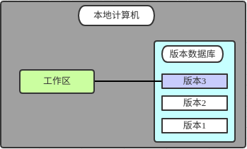
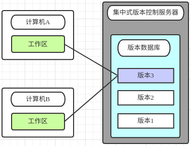
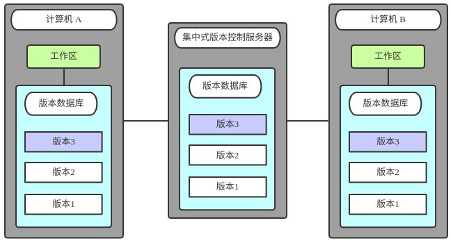

# 目录
[正文](#content)
* [一、Git详解](#1)
  * [1、Git入门](#1-1)
  * [2、Git基础](#1-2)
  * [3、Git常用命令](#1-3)
  * [4、Git服务器搭建](#1-4)
  * [5、问题解决](#1-5)
  * [6、本章总结](#1-6)
* [二、Jenkins搭建与使用](#2)
  + [1、Jenkins介绍](#2-1)
    + [Jenkins](#2-1-1)
    + [其他开源CI/CD工具](#2-1-2)
      + [GitLab CI](#2-1-2-1)
      + [GoCD](#2-1-2-2)
      + [Travis CI](#2-1-2-3)
      + [Concourse CI](#2-1-2-4)
      + [Spinnaker](#2-1-2-5)
      + [Screwdriver](#2-1-2-6)
  + [2、Jenkins基本原理](#2-2)
  + [3、Jenkins服务搭建](#2-3)
  + [4、问题解决](#2-4)
* [三、docker搭建与使用](#3)
  + [1、docker介绍](#3-1)
  + [2、其他容器产品介绍](#3-2)
    + [gVisor](#3-2-1)
    + [Rocket](#3-2-2)
* [四、搭建CICD](#4)
  * [1、持续集成 CI](#4-1)
  * [2、持续部署 CD](#4-2)
  * [3、CICD容器化](#4-3)
  * [4、CICD上云](#4-4)
* [五、落地场景分析](#5)
  * [1、场景描述](#5-1)
  * [2、运维自动化改造](#5-2)
  * [3、实施CI/CD落地](#5-3)
* [六、总结](#6)

# 正文

## 一、Gitx详解

### 1、GIT入门

#### 1.1 什么是版本控制？
版本控制是一种记录一个或若干文件内容变化，以便将来查阅特定版本修订情况的系统。通常的理解中版本控制是用于对保存着软件源代码的文本文件作版本控制管理，实际上任何类型的文件都可以进行版本控制。有了它你就可以将某个文件回溯到之前的状态，甚至将整个项目都回退到过去某个时间点的状态。你可以比较文件的变化细节，查出最后是谁修改了哪个地方，从而找出导致怪异问题出现的原因，又是谁在何时报告了某个功能缺陷等等。

#### 1.2 本地版本控制
许多人习惯用复制整个项目目录的方式来保存不同的版本，或许还会改名加上备份时间以示区别。这么做唯一的好处就是简单。不过坏处也不少：有时候会混淆所在的工作目录，一旦弄错文件丢了数据就没法撤销恢复。

为了解决这个问题，人们很久以前就开发了许多种本地版本控制系统，大多都是采用某种简单的数据库来记录文件的历次更新差异。

图1.1 本地版本控制系统

#### 1.3 集中式版本控制
接下来人们又遇到一个问题，如何让在不同系统上的开发者协同工作？于是，集中化的版本控制系统（ Centralized Version Control Systems，简称 CVCS ）应运而生。这类系统，诸如 CVS，Subversion 以及 Perforce 等，都有一个单一的集中管理的服务器，保存所有文件的修订版本，而协同工作的人们都通过客户端连到这台服务器，取出最新的文件或者提交更新。

图1.2 集中式版本控制系统

这么做最显而易见的缺点是中央服务器的单点故障。如果宕机一小时，那么在这一小时内，谁都无法提交更新，也就无法协同工作。要是中央服务器的磁盘发生故障，碰巧没做备份，或者备份不够及时，就会有丢失数据的风险。最坏的情况是彻底丢失整个项目的所有历史更改记录，而被客户端偶然提取出来的保存在本地的某些快照数据就成了恢复数据的希望。但这样的话依然是个问题，你不能保证所有的数据都已经有人事先完整提取出来过。本地版本控制系统也存在类似问题，只要整个项目的历史记录被保存在单一位置，就有丢失所有历史更新记录的风险。

#### 1.4 分布式版本控制系统
于是分布式版本控制系统（ Distributed Version Control System，简称 DVCS ）面世了。在这类系统中，像 Git，Mercurial，Bazaar 以及 Darcs 等，客户端并不只提取最新版本的文件快照，而是把代码仓库完整地镜像下来。这么一来，任何一处协同工作用的服务器发生故障，事后都可以用任何一个镜像出来的本地仓库恢复。因为每一次的提取操作，实际上都是一次对代码仓库的完整备份（见图1.3）。

图1.3 分布式版本控制系统

更进一步，许多这类系统都可以指定和若干不同的远端代码仓库进行交互。籍此，你就可以在同一个项目中，分别和不同工作小组的人相互协作。你可以根据需要设定不同的协作流程，比如层次模型式的工作流，而这在以前的集中式系统中是无法实现的。

#### 1.5 小结
[GitHub]:https://github.com/  "GitHub"
[码云]:https://gitee.com/ "码云"
包括软件开发在内的生产生活场景中，我们经常遇到版本控制的问题。针对这个需求，市面上出现了很多的版本控制系统（Version Control System，即 VCS），SVN和Git是我们最常用的两种。早期SVN占据了绝大部分市场，而后来随着Git的出现，越来越多的人选择将它作为版本控制工具，Git社区也越来越强大，比较知名的如[GitHub]、[码云]等都使用Git作为代码托管的“引擎”。

SVN和Git最核心的区别在于Git是分布式的VCS，而SVN需要一个中央版本库进行集中控制。分布式模式的最大好处就是不依赖于网络，每一个pull下来的Git仓库都是主仓库的一个分布式版本，一个可以进行提交的本地仓库。如果你愿意甚至可以一直在本地进行提交。当有网络的时候，本地与远程的仓库也可以进行同步。当然，分布式和集中式各有各的优缺点，但从目前来看，分布式的Git正逐渐被越来越多的人所接受并推广。

这一章节下，我们将讨论Git基础知识、Git常用命令，试图告诉大家Git是如何工作的。我们将进行Git服务器的搭建以及解决在搭建过程中遇到的各种各样的问题。

### 2、Git基础

### 3、Git常用命令

### 4、Git服务器搭建

### 5、问题解决

### 6、本章总结

## 二、Jenkins搭建与使用

### 1、Jenkins介绍

 > Jenkins

 > 其他开源CI/CD工具

1. GitLab CI

2. GoCD

3. Travis CI

4. Concourse CI

5. Spinnaker

6. Screwdriver

### 2、Jenkins基本原理

### 3、Jenkins服务搭建

### 4、问题解决

## 三、docker搭建与使用

### 1、docker介绍

### 2、其他容器产品介绍

> gVisor

> Rocket

## 四、搭建CICD

### 1、持续集成 CI

### 2、持续部署 CD

### 3、CICD容器化

### 4、CICD上云

## 五、落地场景分析

### 1、场景描述

### 2、运维自动化改造

### 3、实施CI/CD落地

## 六、总结