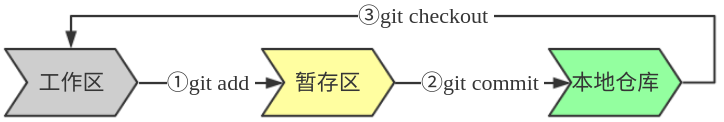

# 目录
[正文](#正文)

* [一、Git详解](#1)
  * [1、Git入门](#sdf)
  * [2、Git基础](#1-2)
  * [3、Git常用命令](#1-3)
  * [4、Git服务器搭建](#1-4)
  * [5、问题解决](#1-5)
  * [6、本章总结](#1-6)
* [二、Jenkins搭建与使用](#2)
  + [1、Jenkins介绍](#2-1)
    + [Jenkins](#2-1-1)
    + [其他开源CI/CD工具](#2-1-2)
      + [GitLab CI](#2-1-2-1)
      + [GoCD](#2-1-2-2)
      + [Travis CI](#2-1-2-3)
      + [Concourse CI](#2-1-2-4)
      + [Spinnaker](#2-1-2-5)
      + [Screwdriver](#2-1-2-6)
  + [2、Jenkins基本原理](#2-2)
  + [3、Jenkins服务搭建](#2-3)
  + [4、问题解决](#2-4)
* [三、docker搭建与使用](#3)
  + [1、docker介绍](#3-1)
  + [2、其他容器产品介绍](#3-2)
    + [gVisor](#3-2-1)
    + [Rocket](#3-2-2)
* [四、搭建CICD](#4)
  * [1、持续集成 CI](#4-1)
  * [2、持续部署 CD](#4-2)
  * [3、CICD容器化](#4-3)
  * [4、CICD上云](#4-4)
* [五、落地场景分析](#5)
  * [1、场景描述](#5-1)
  * [2、运维自动化改造](#5-2)
  * [3、实施CI/CD落地](#5-3)
* [六、总结](#6)

<span id="content"></span>

# 正文
<span id="1"></span>

## 一、Git详解

<span id="1-1"></span>

### 1、什么是Git

[GitHub]:https://github.com/  "GitHub"
[码云]:https://gitee.com/ "码云"
包括软件开发在内的生产生活场景中，我们经常遇到版本控制的问题。针对这个需求，市面上出现了很多的版本控制系统（Version Control System，即 VCS），SVN和Git是我们最常用的两种。早期SVN占据了绝大部分市场，而后来随着Git的出现，越来越多的人选择将它作为版本控制工具，Git社区也越来越强大，比较知名的如[GitHub]、[码云]等都使用Git作为代码托管的“引擎”。

SVN和Git最核心的区别在于Git是分布式的VCS，而SVN需要一个中央版本库进行集中控制。分布式模式的最大好处就是不依赖于网络，每一个pull下来的Git仓库都是主仓库的一个分布式版本，一个可以进行提交的本地仓库。如果你愿意甚至可以一直在本地进行提交。当有网络的时候，本地与远程的仓库也可以进行同步。当然，分布式和集中式各有各的优缺点，但从目前来看，分布式的Git正逐渐被越来越多的人所接受并推广。

Git在CICD中扮演中非常重要的角色，它是我们开发环节中代码管理的重要组件，也是触发我们持续集成、自动化测试的关键节点。除了开发测试场景，生产上配置文件、web页面以及所有有版本管理需求的地方都可以用到Git。所以，这一章节下我们将讨论Git基础知识、Git常用命令，试图告诉大家Git是如何工作的。我们将进行Git服务器的搭建、配置触发自动集成、自动测试以及与大家讨论一种生产上使用Git进行配置文件、web页面管理的一种场景。

#### 1.1 版本控制的演进

##### 1.1.1 什么是版本控制？
版本控制是一种记录一个或若干文件内容变化，以便将来查阅特定版本修订情况的系统。通常的理解中版本控制是用于对保存着软件源代码的文本文件作版本控制管理，实际上任何类型的文件都可以进行版本控制。
有了版本控制我们就可以将某个文件回溯到之前的状态，甚至将整个项目都回退到过去某个时间点的状态。我们可以比较文件的变化细节，查出所有的历史记录，明确缺陷的责任人、问题的提出者。

##### 1.1.2 本地版本控制
在使用计算机管理多版本文件的生产和生活中，我们常用的做法是复制整个项目目录的方式来保存不同的版本，或许还会改名加上备份时间以示区别。这估计能引起大多数人的共鸣，因为这么做实在是太简单了。但是，如果你混淆所在的工作目录，弄错文件或者丢了数据那就崩溃去吧。

为了解决这个问题，人们很久以前就开发了许多种本地版本控制系统，大多都是采用某种简单的数据库来记录文件的历次更新差异。如下图：

<div align="center">

<div>图1.1 本地版本控制系统</div>
</div>


##### 1.1.3 集中式版本控制
本地版本控制无法实现让在不同系统上的开发者协同工作。于是，集中化的版本控制系统（ Centralized Version Control Systems，简称 CVCS ）应运而生。我们比较熟悉如SVN 、 CVS 等，都有一个单一的集中管理的服务器，保存所有文件的修订版本，而协同工作的人们都通过客户端连到这台服务器，取出最新的文件或者提交更新。

<div align="center">

<div>图1.2 集中式版本控制系统</div>
</div>
显而易见，最大的缺点是中央服务器的单点故障。

1. 宕机风险：如果宕机一小时，那么在这一小时内，谁都无法提交更新，也就无法协同工作。
2. 要是中央服务器的磁盘发生故障，碰巧没做备份，或者备份不够及时，就会有丢失数据的风险。
3. 最坏的情况是彻底丢失整个项目的所有历史更改记录，而被客户端偶然提取出来的保存在本地的某些快照数据就成了恢复数据的希望。但这样的话依然是个问题，你不能保证所有的数据都已经有人事先完整提取出来过。

##### 1.1.4 分布式版本控制系统
于是分布式版本控制系统（ Distributed Version Control System，简称 DVCS ）面世了。在这类系统中，像 Git，Mercurial，Bazaar 以及 Darcs 等，客户端并不只提取最新版本的文件快照，而是把代码仓库完整地镜像下来。这么一来，任何一处协同工作用的服务器发生故障，事后都可以用任何一个镜像出来的本地仓库恢复。因为每一次的提取操作，实际上都是一次对代码仓库的完整备份（见图1.3）。
<div align="center">

<div>图1.3 分布式版本控制系统</div>
</div>

更进一步，许多这类系统都可以指定和若干不同的远端代码仓库进行交互。籍此，你就可以在同一个项目中，分别和不同工作小组的人相互协作。你可以根据需要设定不同的协作流程，比如层次模型式的工作流，而这在以前的集中式系统中是无法实现的。

#### 1.2 Git简史
Git源于对Linux内核开源项目的维护和管理。2005年BitKeeper商用化，Linux内核开源项目不得不放弃使用BitKeeper，Linux开源社区以及Linux的缔造者Linus Torvalds意识到需要开发一套属于自己的版本控制系统。他们对这个版本控制系统制定了如下需求：
1. 速度
2. 简单的设计
3. 支持非线性开发模式（允许上千个并行开发）
4. 完全分布式
5. 高效管理类似Linux内核一样的超大规模的项目

自2005年诞生以来，Git日臻完善，在高度易用的同时，仍然保留着初期设定的目标。它的速度飞快，极其适合管理大项目，它还有着令人难以置信的非线性分支管理系统，可以应付各种复杂的项目开发需求。

#### 1.3 Git设计思想和基本工作原理
在开始学习Git的过程中，理解Git的设计思想以及基本工作原理将有助于我们准确地使用Git提供的各个功能。

##### 1.3.1 Git只关心文件本身是否发生变化
如何理解标题呢？简单理解一下：在某文件更新前后，判断该文件是否发生更新，只算一下该文件前后的哈希值，如果哈希值发生变化，那么Git将变化的文件作一个快照，记录在一个**微型的文件系统**中；如果哈希值不变，为了提高性能，Git不会再次保存，而是只对上次保存的快照作一个链接。
Git更像是一个小型的文件系统，在此基础之上还提供了更多更强的工具，而不只是一个简单的VCS。

##### 1.3.2 Git中99%的操作都无需联网

因为Git是分布式的， 在本地磁盘上就保存着所有当前项目的历史更新，所以不依赖于网络，处理起来速度飞快。即使身处无网络的环境，我们仍然可以非常愉快地频繁提交更新，并且在本地进行所有项目版本的管理。等到了有网络的时候，我们再与远程仓库进行同步。

如果想要看当前版本的文件和一个月前的版本之间有何差异，Git 会取出本地磁盘上微型文件系统中一个月前的快照和当前文件作一次差异运算，而不用请求远程服务器来做这件事。

##### 1.3.3 Git如何保证数据的一致性和完整性

Git 使用 SHA-1 算法计算数据的校验和，通过对文件的内容或目录的结构计算出一个 SHA-1 哈希值。该字串由 40 个字符（0-9 及 a-f）组成，它其实是算出的校验和的十六进制表示。看起来就像是：

```shell
8d73a23d429299cdf9876a87e9fa85ad4f1e1b37
```

保存在Git中的所有文件都要进行上述校验和（checksum）计算，并将此结果作为数据的唯一标识和索引。这项特性作为 Git 的设计哲学，建在整体架构的最底层。所以如果文件在传输时变得不完整，或者磁盘损坏导致文件数据缺失，Git 都能立即察觉。

Git 的工作完全依赖于上述40个字符的字符串，所有保存在 Git 数据库中的东西都是用此哈希值来作索引的，而不是靠文件名。

##### 1.3.4 Git中文件三态

Git中的任何一个文件，都只有三种状态：

1. modified （已修改）
2. staged （已暂存）
3. committed （已提交）

<div align="center">

<div>图1.3.2-1 Git工作区、暂存区、仓库</div>
</div>

当在工作区新增或者修改了某个文件，那么该文件就处于modified状态。如果现在进行上图中的操作①，那么Git就会将该文件作一个快照保存在暂存区，该文件就处于staged状态。接下来，如果该文件进行了上图中的操作②，那么Git将保存在暂存区域的文件快照永久转储到 Git 目录中，该文件就处于committed状态了。

#### 1.4 Git安装

理解了Git的设计思想和基本工作原理，咱们就开始实际操作了。

##### 1.4.1 从源代码安装

从源代码安装有很多好处，首先能够保证不会下载到被嵌入恶意代码的二进制包，其次能够使用修复了安全和功能BUG的最新的Git版本。

Git编译依赖curl，zlib，openssl，expat，libiconv库的部分代码。

Centos、Redhat、Fedora需要安装：

```shell
sudo yum install curl-devel expat-devel gettext-devel \
  openssl-devel zlib-devel
```

Debian、Ubuntu、Deepin需要安装：

```shell
sudo apt-get install libcurl4-gnutls-dev \
libexpat1-dev gettext libz-dev libssl-dev
```

从Git官方站点下载最新源代码：

```shell
# 从Git官网下载
http://git-scm.com/download
# 从GitHub下载最新的源代码包
wget https://github.com/git/git/archive/v2.20.1.tar.gz
```

编译和安装：

```shell
$ tar -zxf git-1.7.2.2.tar.gz
$ cd git-1.7.2.2
$ make prefix=/usr/local all
$ sudo make prefix=/usr/local install
```


<span id="1-2"></span>

### 2、Git基础

<span id="1-3"></span>

### 3、Git常用命令

<span id="1-4"></span>
### 4、Git服务器搭建

<span id="1-5"></span>
### 5、问题解决

<span id="1-6"></span>
### 6、本章总结


<span id="2"></span>
## 二、Jenkins搭建与使用

<span id="2-1"></span>
### 1、Jenkins介绍

<span id="2-1-1"></span>
 > Jenkins

<span id="2-1-2"></span>
 > 其他开源CI/CD工具

<span id="2-1-2-1"></span>
1. GitLab CI
<span id="2-1-2-2"></span>
2. GoCD
<span id="2-1-2-3"></span>
3. Travis CI
<span id="2-1-2-4"></span>
4. Concourse CI
<span id="2-1-2-5"></span>
5. Spinnaker
<span id="2-1-2-6"></span>
6. Screwdriver

<span id="2-2"></span>
### 2、Jenkins基本原理

<span id="2-3"></span>
### 3、Jenkins服务搭建

<span id="2-4"></span>
### 4、问题解决

<span id="3"></span>
## 三、docker搭建与使用

<span id="3-1"></span>
### 1、docker介绍

<span id="3-2"></span>
### 2、其他容器产品介绍

<span id="3-2-1"></span>
> gVisor

<span id="3-2-2"></span>
> Rocket


<span id="4"></span>
## 四、搭建CICD

<span id="4-1"></span>
### 1、持续集成 CI

<span id="4-2"></span>
### 2、持续部署 CD

<span id="4-3"></span>
### 3、CICD容器化

<span id="4-4"></span>
### 4、CICD上云

<span id="5"></span>
## 五、落地场景分析

<span id="5-1"></span>
### 1、场景描述

<span id="5-2"></span>
### 2、运维自动化改造

<span id="5-3"></span>
### 3、实施CI/CD落地

<span id="6"></span>

## 六、总结