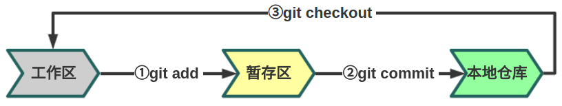
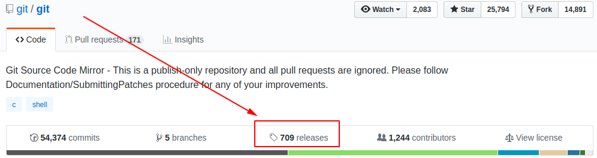
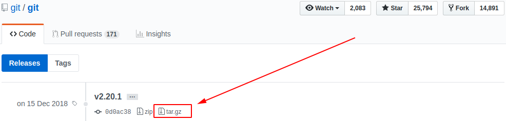
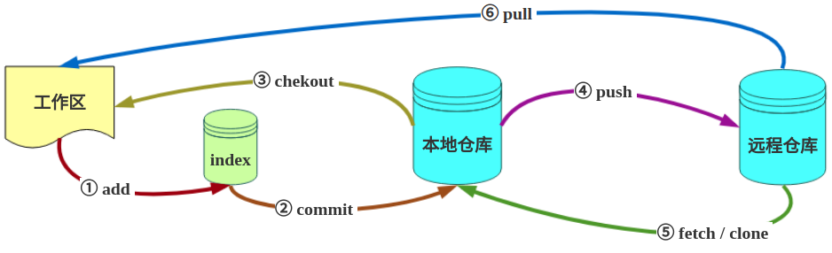
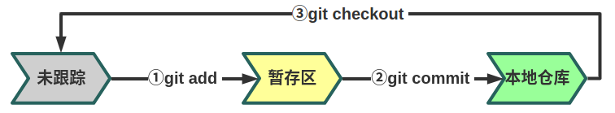
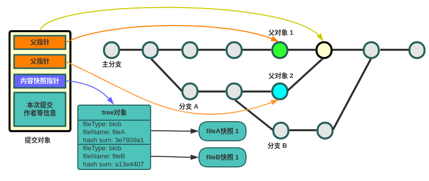
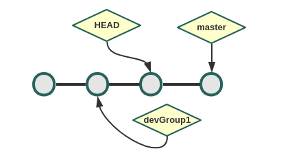
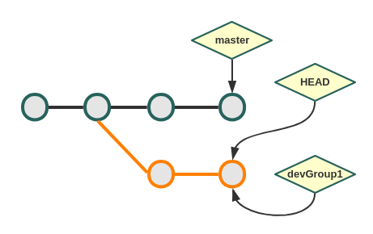
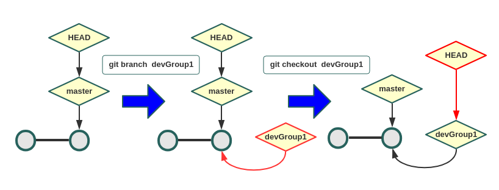
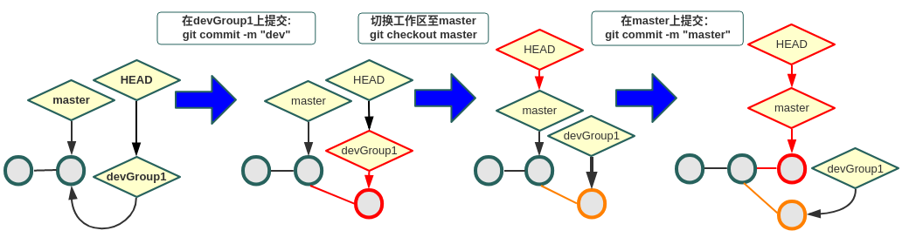

# 正文

## 一、使用Git进行开发项目管理

### 1、什么是Git

包括软件开发在内的生产生活场景中，我们经常遇到版本控制的问题。针对这个需求，市面上出现了很多的版本控制系统（Version Control System，即 VCS），SVN和Git是我们最常用的两种。早期SVN占据了绝大部分市场，而后来随着Git的出现，越来越多的人选择将它作为版本控制工具，Git社区也越来越强大，比较知名的如[GitHub](https://github.com/)、[码云](https://gitee.com/)等都使用Git作为代码托管的“引擎”。

SVN和Git最核心的区别在于Git是分布式的VCS，而SVN需要一个中央版本库进行集中控制。分布式模式的最大好处就是不依赖于网络，每一个pull下来的Git仓库都是主仓库的一个分布式版本，一个可以进行提交的本地仓库。如果你愿意甚至可以一直在本地进行提交。当有网络的时候，本地与远程的仓库也可以进行同步。当然，分布式和集中式各有各的优缺点，但从目前来看，分布式的Git正逐渐被越来越多的人所接受并推广。

Git在CICD中扮演中非常重要的角色，它是我们开发环节中代码管理的重要组件，也是触发我们持续集成、自动化测试的关键节点。除了开发测试场景，生产上配置文件、web页面以及所有有版本管理需求的地方都可以用到Git。所以，这一章节下我们将讨论Git基础知识、Git常用命令，试图告诉大家Git是如何工作的。我们将进行Git服务器的搭建、配置触发自动集成、自动测试以及与大家讨论一种生产上使用Git进行配置文件、web页面管理的一种场景。

#### 1.1 版本控制的演进

##### 1.1.1 什么是版本控制？
版本控制是一种记录一个或若干文件内容变化，以便将来查阅特定版本修订情况的系统。通常的理解中版本控制是用于对保存着软件源代码的文本文件作版本控制管理，实际上任何类型的文件都可以进行版本控制。
有了版本控制我们就可以将某个文件回溯到之前的状态，甚至将整个项目都回退到过去某个时间点的状态。我们可以比较文件的变化细节，查出所有的历史记录，明确缺陷的责任人、问题的提出者。

##### 1.1.2 本地版本控制
在使用计算机管理多版本文件的生产和生活中，我们常用的做法是复制整个项目目录的方式来保存不同的版本，或许还会改名加上备份时间以示区别。这估计能引起大多数人的共鸣，因为这么做实在是太简单了。但是，如果你混淆所在的工作目录，弄错文件或者丢了数据那就崩溃去吧。

为了解决这个问题，人们很久以前就开发了许多种本地版本控制系统，大多都是采用某种简单的数据库来记录文件的历次更新差异。如下图：

<div align="center">

<div>图1.1.2-1 本地版本控制系统</div>
</div>


##### 1.1.3 集中式版本控制
本地版本控制无法实现让在不同系统上的开发者协同工作。于是，集中化的版本控制系统（ Centralized Version Control Systems，简称 CVCS ）应运而生。我们比较熟悉如SVN 、 CVS 等，都有一个单一的集中管理的服务器，保存所有文件的修订版本，而协同工作的人们都通过客户端连到这台服务器，取出最新的文件或者提交更新。

<div align="center">

<div>图1.1.3-1 集中式版本控制系统</div>
</div>

显而易见，最大的缺点是中央服务器的单点故障。

1. 宕机风险：如果宕机一小时，那么在这一小时内，谁都无法提交更新，也就无法协同工作。
2. 要是中央服务器的磁盘发生故障，碰巧没做备份，或者备份不够及时，就会有丢失数据的风险。
3. 最坏的情况是彻底丢失整个项目的所有历史更改记录，而被客户端偶然提取出来的保存在本地的某些快照数据就成了恢复数据的希望。但这样的话依然是个问题，你不能保证所有的数据都已经有人事先完整提取出来过。

##### 1.1.4 分布式版本控制系统
于是分布式版本控制系统（ Distributed Version Control System，简称 DVCS ）面世了。在这类系统中，像 Git，Mercurial，Bazaar 以及 Darcs 等，客户端并不只提取最新版本的文件快照，而是把代码仓库完整地镜像下来。这么一来，任何一处协同工作用的服务器发生故障，事后都可以用任何一个镜像出来的本地仓库恢复。因为每一次的提取操作，实际上都是一次对代码仓库的完整备份（见图1.3）。
<div align="center">

<div>图1.1.4-1 分布式版本控制系统</div>
</div>


更进一步，许多这类系统都可以指定和若干不同的远端代码仓库进行交互。籍此，你就可以在同一个项目中，分别和不同工作小组的人相互协作。你可以根据需要设定不同的协作流程，比如层次模型式的工作流，而这在以前的集中式系统中是无法实现的。

#### 1.2 Git简史
Git源于对Linux内核开源项目的维护和管理。2005年BitKeeper商用化，Linux内核开源项目不得不放弃使用BitKeeper，Linux开源社区以及Linux的缔造者Linus Torvalds意识到需要开发一套属于自己的版本控制系统。他们对这个版本控制系统制定了如下需求：
1. 速度
2. 简单的设计
3. 支持非线性开发模式（允许上千个并行开发）
4. 完全分布式
5. 高效管理类似Linux内核一样的超大规模的项目

自2005年诞生以来，Git日臻完善，在高度易用的同时，仍然保留着初期设定的目标。它的速度飞快，极其适合管理大项目，它还有着令人难以置信的非线性分支管理系统，可以应付各种复杂的项目开发需求。

#### 1.3 Git设计思想和基本工作原理
在开始学习Git的过程中，理解Git的设计思想以及基本工作原理将有助于我们准确地使用Git提供的各个功能。

##### 1.3.1 Git只关心文件本身是否发生变化
如何理解标题呢？简单理解一下：在某文件更新前后，判断该文件是否发生更新，只算一下该文件前后的哈希值，如果哈希值发生变化，那么Git将变化的文件作一个快照，记录在一个**微型的文件系统**中；如果哈希值不变，为了提高性能，Git不会再次保存，而是只对上次保存的快照作一个链接。

Git可以被理解为一个小型的文件系统，在此基础之上还提供了更多更强的工具，不只是一个简单的VCS。

##### 1.3.2 Git中99%的操作都无需联网

因为Git是分布式的， 在本地磁盘上就保存着所有当前项目的历史更新，所以不依赖于网络，处理起来速度飞快。即使身处无网络的环境，我们仍然可以非常愉快地频繁提交更新，并且在本地进行所有项目版本的管理。等到了有网络的时候，我们再与远程仓库进行同步。

如果想要看当前版本的文件和一个月前的版本之间有何差异，Git 会取出本地磁盘上微型文件系统中一个月前的快照和当前文件作一次差异运算，而不用请求远程服务器来做这件事。

##### 1.3.3 Git如何保证数据的一致性和完整性

Git 使用 SHA-1 算法计算数据的校验和，通过对文件的内容或目录的结构计算出一个 SHA-1 哈希值。该字串由 40 个字符（0-9 及 a-f）组成，它其实是算出的校验和的十六进制表示。看起来就像是：

```shell
8d73a23d429299cdf9876a87e9fa85ad4f1e1b37
```

保存在Git中的所有文件都要进行上述校验和（checksum）计算，并将此结果作为数据的唯一标识和索引。这项特性作为 Git 的设计哲学，建在整体架构的最底层。所以如果文件在传输时变得不完整，或者磁盘损坏导致文件数据缺失，Git 都能立即察觉。

Git 的工作完全依赖于上述40个字符的字符串，所有保存在 Git 数据库中的东西都是用此哈希值来作索引的，而不是靠文件名。

##### 1.3.4 Git中文件三态

Git中的任何一个文件，都只有三种状态：

1. modified （已修改）
2. staged （已暂存）
3. committed （已提交）

<div align="center">

<div>图1.3.2-1 Git工作区、暂存区、仓库</div>
</div>


当在工作区新增或者修改了某个文件，那么该文件就处于modified状态。如果现在进行上图中的操作①，那么Git就会将该文件作一个快照保存在暂存区，该文件就处于staged状态。接下来，如果该文件进行了上图中的操作②，那么Git将保存在暂存区域的文件快照永久转储到 Git 目录中，该文件就处于committed状态了。

#### 1.4 Git安装

理解了Git的设计思想和基本工作原理，咱们就开始实际操作了。

##### 1.4.1 从源代码安装

从源代码安装有很多好处，首先能够保证不会下载到被嵌入恶意代码的二进制包，其次能够使用修复了安全和功能BUG的最新的Git版本。

Git编译依赖curl，zlib，openssl，expat，libiconv库的部分代码。

Centos、Redhat、Fedora需要安装：

```shell
sudo yum install curl-devel expat-devel gettext-devel \
  openssl-devel zlib-devel
```

Debian、Ubuntu、Deepin需要安装：

```shell
sudo apt-get install libcurl4-gnutls-dev \
libexpat1-dev gettext libz-dev libssl-dev
```

从Git官方站点下载最新源代码：

```shell
# 从Git官网下载
http://git-scm.com/download
# 从GitHub下载最新的源代码包
wget https://github.com/git/git/archive/v2.20.1.tar.gz
```

<div align="center">

<div>图1.4.1-1 从GitHub上下载Git源代码包（1）</div>
</div>
<div align="center">

<div>图1.4.1-1 从GitHub上下载Git源代码包（2）</div>
</div>

编译和安装：

```shell
$ tar -zxf git-v2.20.1.tar.gz
$ cd git-v2.20.1
$ make prefix=/usr/local/git all
$ sudo make prefix=/usr/local/git install
```

安装完成之后执行 git version，有些用户可能发现还是旧版本。可执行如下命令：

```shell
# 找出旧版本git 可执行文件的路径
$ whereis git
git: /usr/bin/git /usr/share/man/man1/git.1.gz
# 将原来的git可执行文件或者软链接备份
sudo mv /usr/bin/git /usr/bin/git.bak
# 将安装目录下的最新版Git可执行文件,通过软连接方式链接到/usr/bin/git
sudo ln -s /usr/local/git/git  /usr/bin/git
```

如果出现如下结果，则安装成功。

```shell
$ git version
git version 2.20.1
```

##### 1.4.2 二进制文件安装

**Debian系的Linux**

```shell
$ sudo add-apt-repository ppa:git-core/ppa
$ sudo apt update
$ sudo apt install git
```

以上是安装最新版本的Git方式，如果没有最新版本Git 的需求，执行如下命令：

```shell
sudo apt-get install git
```

**RedHat系的Linux**

```shell
sudo yum install git 
```

以上命令只安装yum源中的版本，如需使用最新版本，建议使用源码编译方式安装。

**Windows**

可在[Git官网](https://git-scm.com/downloads)下载Windows版本的.exe格式二进制文件进行安装即可。

**Mac OS X**

可在[Git官网](https://git-scm.com/downloads)下载Mac OS X版本的.dmg格式二进制文件进行安装即可。

#### 1.5 Git配置

安装完成之后，我们需要配置一下Git环境。执行配置命令之后，Git会将配置信息写入文件系统中，不用重复配置。如果需要修改配置可直接修改配置文件或者再次执行配置命令。

Git配置文件主要有三个：

* /etc/gitconfig，优先级最低，该文件对应于如下命令：

```shell
sudo git config --system  user.name  "neroshea"
```

* ~/.gitconfig，优先级其次，该文件是隐藏文件处于用户目录下：

```shell
git config --global  user.name "neroshea"
```

* ${workdir}/.git/config，优先级最高，该文件处于工作区文件夹下：

```shell
git config --local  use.name "neroshea"
```

其中 --local 对应的配置文件优先级最高，只在本工作区起作用。--global 对应的配置文件只适用于当前用户，文件中配置项的优先级其次。--system 对应的配置文件适用于本机所有用户，文件中配置项的优先级最低。优先级高的覆盖优先级低的配置。

熟悉了上述三个文件之后，我们现在开始进行Git配置。

**用户信息配置**

首先配置用户名称和电子邮箱，这两个配置非常重要，Git通过这两个配置来标识是谁做了提交，并且这些信息将会永久写入历史记录中。

```shell
$ git config --global user.name "neroshea"
$ git config --global user.email test@example.com
```

一般情况下配置global即可。配置local则每次新建工作区都需配置该信息；配置system则会干扰其他用户的使用，普通用户也没有配置system的权限。

**文本编辑器**

Git在需要你填入某些信息的时候会自动打开一个编辑器，系统默认为vi或vim编辑器，如果你有特殊需求可以进行配置。

```shell
git config --global core.editor emacs
```

一般不做修改。

**差异分析工具**

当我们解决合并冲突时，需要用到差异分析工具，默认为diff。可修改，如改成vimdiff。

```shell
git config --global merge.tool vimdiff
```

Git 可以理解 kdiff3，tkdiff，meld，xxdiff，emerge，vimdiff，gvimdiff，ecmerge，和 opendiff 等合并工具的输出信息。

**查看配置信息**

检查已有的配置信息：

```shell
git config --list
```

检查特定项目：

```shell
git config user.name
```

#### 1.6 Git帮助

当你不知道如何使用git 时，最快的方法就是使用：

```shell
git help <cmd>
# 比如，查看git config 的用法
git help config
```

如果可以联网，可通过搜索引擎查询。

#### 1.7 小结

这一小结我们详细介绍了Git是什么、Git的由来、Git的设计思想和基本原理、Git安装配置。了解了上述知识，大家理解Git的操作就很方便了，以后学习Git就能更加顺利。

### 2、Git操作和管理

>  光大科技公司Git命令操作规范，Git分支管理，简短有力、全面、能进能退，收放自如。

现代工业体系中的项目运作从来不是一个人独角戏，必定是多人协作。软件工程也不是计算机产业上古时期某个程序员两三天弄出来的小demo。这一章节我们将讨论如何使用Git参与到项目的协作中来。

我试图使用非常简单的图文来向大家描述Git操作命令，每个参数都有示例并告诉大家这些参数的区别。在进行详细的说明之前，大家可以通过图2-1对Git仓库之间的流转有一个整体的了解。



<div align="center">图2-1 Git操作与仓库之间的关系</div>

#### 2.1 与Git远程仓库交互

要参与到Git项目的协作，我们首先需要了解远程仓库。远程仓库是指托管在网络上的Git仓库，可能有多个，有些是只读镜像，另外的是可写。同他人协作开发某个项目时，需要管理这些远程仓库，以便推送或拉取数据，分享各自的工作进展。管理远程仓库的工作，包括添加远程库，移除废弃的远程库。

本小节我们将详细讨论与Git远程库的交互，我们将以场景的方式来描述Git远程仓库的使用。

##### **2.1.1：在Git服务器中添加Git客户端的SSH KEY**

```shell
# 在Git客户端中执行如下命令；
$ ssh-keygen -t rsa -b 4096 -f  keyFileName -q -N "newPasswd" -C "this is a comment."
# -t key的类型，默认rsa；-b key的字节数，默认2048；-f key写在哪个文件中
# -C 注释；-q 静默执行；-N 设置rsa新密码
# 查看当前目录将会有两个文件
$ ls
keyFileName  keyFileName.pub
$ cat keyFileName.pub
```

公钥字符串，将如下字符串粘贴至Git服务器中：

```tex
ssh-rsa AAAAB3NzaC1yc2EAAAADAQABAAACAQC1wPUf9iInniRzEjhl3B9IOlsNnnPs7habIftsrjyiDmNEBOrkHNgoLquY4TTk2eZE8ljwzSSk3IYmFaBf37YNqb1gZIoQQ2z51fhCtNEBnJIVe7ZebaEd/0UMpb9c5qt9a/QbAFWMD4udixq/hgcGCQYnRq0oOk3p6wXJrllDqf/mk97BTVboXXrinPtS5MS2DLT5wd8rgkiZSJlXVp/6jaXNGM44lYK8qq1vGwRFywXmyYALl1sV43ktybqH6zwq3ZIsDAVDLST7FZX8Qp+Flg0II6+BGWelXvhHTfDSrkxL5UD0jHfzTtma+FOx9NNL5YesngqBuyWeRmozQfm/+uv2FQxVQ3CFv/+3njW12+eRAfb6eQzQgnahKlGKY7xoijc6agdWAiEP13jCOlfgIs4ZEYMGOoA+vlQu21ENTxwbuwMGfrZ8xizPsrHQtcWv/75h0xlZWKJ6P8OuAGel86l3lyA2YdBNNQfxsXMK4ECiYV70LnYJPhevR5ekOc4jZbomrqu16ex98TQpk2h+S2ju0OFzlSc9E3poufSd3Z5ZhyzOsDm2lFTg8m5KELd90LIm9aBRQ628SxqDnYHV+84PWPDNrVsu0o6bh//ln1WT5J9WU16U5HslYPl9NCFbbAXJHti63tsKz99YrCDFezRIk0nKPHSfwMZjKJrqSw== this is a comment.
```

##### **2.1.2：查看当前目录是否与远程仓库相关联**

```shell
# 查看当前目录是否是Git仓库以及Git仓库状态
$ git status
# 查看当前仓库是否添加了远程仓库
$ git remote -v
```

##### **2.1.3：克隆一个远程仓库**

```shell
# 命令中的 “gitHubAlias” 为自定义的名字，clone完成之后，仓库将处于这个自定义名字的文件夹下。
# 如果不填，那么这个仓库的文件夹名默认为远程仓库的名字。
# Git 支持许多数据传输协议。之前的例子使用的是 git:// 协议，不过你也可以用 http(s):// 或者 
# user@server:/path.git 表示的 SSH 传输协议。
$ git clone https://github.com/git/git.git  gitHubAlias
```

##### **2.1.4：如果本地没有仓库，需要新建本地仓库，并且将本地仓库与空的远程仓库相关联。**

```shell
# 创建README.md文件，将引号中的字符串写入该文件中
$ echo "# gittest" >> README.md
# 初始化一个本地仓库
$ git init
# 让Git跟踪监控README.md文件，如果不这样做，Git将不会管这个文件。
$ git add README.md
# 将被跟踪文件的变更提交到本地仓库
$ git commit -m "first commit"
# 在本地仓库添加远程仓库。一个本地仓库可添加多个远程仓库。对本地仓库来说只是添加了一个别名而已。
$ git remote add origin https://github.com/niroshea/gittest.git
# 将本地仓库中的提交推送至远程仓库（别名origin）的master分支中。-u 参数：设置默认上传流。
$ git push -u origin master
```

git push 介绍

```shell
# git push 使用本地的对应分支来更新对应的远程分支。
$ git push <远程仓库> <本地分支名>:<远程分支名>
# 注意: 命令中的本地分支是指将要被推送到远端的分支，而远程分支是指推送的目标分支，即将本地分支合并到远程分支。 
# 如果省略远程分支名，则表示将本地分支推送与之存在”追踪关系”的远程分支(通常两者同名)，如果该远程分支不存在，则会被新建。
$ git push origin master
# 如果省略本地分支名，则表示删除指定的远程分支，因为这等同于推送一个空的本地分支到远程分支，这条命令是删除远程master分支。
$ git push origin :master
# 等同于
$ git push origin --delete master
# 如果当前分支与远程分支之间存在追踪关系（即分支名相同），则本地分支和远程分支都可以省略。
$ git push origin
# 如果当前分支只有一个追踪分支，那么主机名都可以省略。
$ git push
# 如果当前分支与多个主机存在追踪关系，则可以使用-u选项指定一个默认主机，这样后面就可以不加任何参数使用git push。
$ git push -u origin master
# 还有一种情况，就是不管是否存在对应的远程分支，将本地的所有分支都推送到远程主机，这时需要使用–all选项。
$ git push --all origin
# 如果远程主机的版本比本地版本更新，推送时Git会报错，要求先在本地做git pull合并差异，然后再推送到远程主机。这时，如果你一定要推送，可以使用–force选项。应该尽量避免使用–force选项。
$ git push --force origin
# 最后，git push不会推送标签(tag)，除非使用–tags选项。
$ git push origin --tags
```

##### **2.1.5：本地已有仓库，需将本地仓库与远程仓库相关联，并将本地仓库中的提交推送至空的远程仓库。**

```shell
# 将本地仓库与远程仓库(别名origin)相关联
$ git remote add origin https://github.com/niroshea/gittest.git
# 将本地仓库中的提交推送至远程仓库（别名origin）的master分支中。-u 参数：设置默认上传流。
$ git push -u origin master
```

##### **2.1.6：如果远程仓库不为空，且内容不可忽略，需将本地仓库与远程仓库合并并且相关联。**

```shell
$ git remote add origin https://github.com/niroshea/gittest.git
# 将远程仓库的所有提交合并至本地仓库。
$ git pull origin
```

git pull 介绍

```shell
# git pull 获取并合并其他的仓库，或者本地的其他分支。
$ git pull <远程仓库> <远程分支>:<本地分支>
# 将origin厂库的master分支拉取并合并到本地的my_test分支上。
$ git pull origin master:my_test
# 如果省略本地分支，则将自动合并到当前所在分支上。如下：
$ git pull origin master
```

##### **2.1.7：需要拉取远程仓库到本地仓库，先查看区别，再进行合并。**

```shell
$ git fetch origin master:temp 
#在本地新建一个temp分支，并将远程origin仓库的master分支代码下载到本地temp分支
$ git diff temp 
#来比较本地代码与刚刚从远程下载下来的代码的区别
$ git merge temp
#合并temp分支到本地的master分支
$ git branch -d temp
#如果不想保留temp分支 可以用这步删除
```

##### **2.1.8：拉取远程非master分支**

```shell
# 拉取远程仓库origin的dev分支并且合并至本地master分支
$ git pull origin dev:master
# 修改之后，如果需要提交至远程仓库，执行如下命令即可。
$ git push origin master:dev
```

#### 2.2 创建、删除本地Git仓库

##### 2.2.1 创建Git仓库、添加追踪

```shell
# 要对现有的某个项目开始用 Git 管理，只需到此项目所在的目录，执行：
$ git init
# 初始化后，在当前目录下会出现一个名为 .git 的目录，所有 Git 需要的数据和资源都存放在这个目录中。
$ ls -la
drwxr-xr-x  3 nero nero 4096 1月  31 15:40 .
drwxr-xr-x 56 nero nero 4096 1月  31 15:40 ..
drwxr-xr-x  7 nero nero 4096 1月  31 15:40 .git
# 使用 git add 命令告诉 Git 对文件以及文件的修改进行跟踪。
# git add <文件名，或文件夹名>
$ touch test.sh
# Git跟踪新建的文件
$ git add test.sh
$ vim test.sh
# Git跟踪文件的修改
$ git add test.sh
# 在Git仓库根目录执行如下命令，则仓库中所有的文件以及文件的修改都被跟踪。
# 只有被Git跟踪的文件或文件的修改才能被提交。
$ git add .
```

##### 2.2.2 解除Git纳管

```shell
# 如果不希望Git纳管当前目录，执行如下命令：
$ rm -rf .git
```

##### 2.2.3 忽略某些文件

```shell
# 如何让git忽略某些文件呢，编辑 .gitignore
$ cat .gitignore
# 忽略以.a或者.o结尾的文件
*.[oa]
# 忽略以~结尾的文件
*~
# 忽略以.~开头的文件
.~*
# 但 lib.a 除外
!lib.a
# 仅仅忽略项目根目录下的 TODO 文件，不包括 subdir/TODO
/TODO
# 忽略 build/ 目录下的所有文件
build/
# 会忽略 doc/notes.txt 但不包括 doc/server/arch.txt
doc/*.txt

# 可能还需要忽略 log，tmp 或者 pid 目录，以及自动生成的文档等等。
# 要养成一开始就设置好 .gitignore 文件的习惯，以免将来误提交这类无用的文件。
```

文件 .gitignore 的格式规范如下：

```shell
# 1、所有空行或者以注释符号 ＃ 开头的行都会被 Git 忽略。
# 2、可以使用标准的 glob 模式匹配。
# 3、匹配模式最后跟反斜杠（/）说明要忽略的是目录。
# 4、要忽略指定模式以外的文件或目录，可以在模式前加上惊叹号（!）取反。
# 所谓的 glob 模式是指 shell 所使用的简化了的正则表达式。星号（*）匹配零个或多个任意字符；[abc] 匹配任何一个列在方括号中的字符（这个例子要么匹配一个 a，要么匹配一个 b，要么匹配一个 c）；问号（?）只匹配一个任意字符；如果在方括号中使用短划线分隔两个字符，表示所有在这两个字符范围内的都可以匹配（比如 [0-9] 表示匹配所有 0 到 9 的数字）。
```

#### 2.3 Git对比差异、提交、撤销操作



<div align="center">图2.3-1 Git操作与仓库之间的关系</div>

```shell
# 查看当前仓库的状态，哪些文件追踪、未追踪，哪些文件的修改追踪、未追踪，哪些追踪没有提交都会提示出来。
$ git status
```

##### 2.3.1 对比差异

如图2.3-1所示，如果要查看**未跟踪区**和**暂存区**间修改了什么地方，可以用 git diff 命令：

```shell
# 实际上 git status 的显示比较简单，仅仅是列出了修改过的文件。
# 如果要查看具体修改了什么地方，可以用 git diff 命令
$ git diff
# 此命令比较的是工作目录中当前文件和暂存区域快照之间的差异，也就是修改之后还没有暂存起来的变化内容。
```

如果要查看**暂存区**和**本地仓库**之间的不同，执行如下命令：

```shell
$ git diff --cached
# Git 1.6.1 及更高版本还允许使用 git diff --staged，效果是相同的。
$ git diff --staged
```

##### 2.3.2 提交更新

```shell
# 想要提交暂存区的内容时，执行git commit 将会将暂存区的内容提交至git仓库中
$ git commit
# 执行之后会弹出默认编辑器，让你输入提交的备注。
# Git是用于项目管理的，别人不知道你提交了什么，如何管理项目。尽量详细写提交备注（可以使用中文）。

# 如果实在没什么好说的，备注很简短，使用如下命令（可以使用中文）：
$ git commit -m "我的备注"
```

跳过暂存区，直接提交

```shell
# 尽管使用暂存区域的方式可以精心准备要提交的细节，但有时候这么做略显繁琐。
# Git 提供了一个跳过使用暂存区域的方式。
# 只要在提交的时候，给 git commit 加上 -a 选项。
# Git 就会自动把所有已经跟踪过的文件暂存起来一并提交，从而跳过 git add 步骤：
$  git commit -a -m "我的备注"
```

移除文件

```shell
# 1、如果该文件未跟踪，通过OS的命令删除文件
$ rm -f test.go
# 2、如果该文件已跟踪、未修改状态，通过git rm删除
$ git rm test.go
# 3、如果该文件已跟踪、修改未跟踪，通过git rm -f 删除
$ git rm -f test.go
# 4、如果该文件已跟踪，想删除Git仓库的追踪，但在本地工作区保留该文件。
$ git rm --cached test.go
# glob正则式批量删除文件
$ git rm log/\*.log
$ git rm \*~
```

移动文件

```shell
# Git 并不跟踪文件移动操作。
# 如果在 Git 中重命名了某个文件，仓库中存储的元数据并不会体现出这是一次改名操作。
# 不过 Git 非常聪明，它会推断出究竟发生了什么。
# 重命名某个文件。
$ git mv test.go dev.go
```

git mv 命令在Git看来是运行了如下三个命令：

```shell
$ mv README.txt README
$ git rm README.txt
$ git add README
# 不管以什么方式，都一样。
```

##### 2.3.3 撤销操作

> Tips：有些撤销操作是不可逆的，所以请务必谨慎小心，一旦失误，就有可能丢失部分工作成果。

修改最后一次提交

```shell
# 有时候我们提交完了才发现漏掉了几个文件没有加，或者提交信息写错了。
# 想要撤消刚才的提交操作，可以使用 --amend 选项重新提交
$ git commit -m 'initial commit'
# 如果此时后悔了，进行如下操作。
$ git add test.go dev.go prod.go
$ git commit --amend -m "我的备注"
```

取消已暂存的文件

```shell
$ git add test.go
$ git status
# 位于分支 master
# 要提交的变更：
#   （使用 "git reset HEAD <文件>..." 以取消暂存）

# 	修改：     test.go
$ git reset HEAD test.go
# 上述命令只是取消了暂存，但是工作区的内容没有变化
```

取消对文件的修改

```shell
$ git checkout -- test.go
# 所有对文件的修改都没有了，因为我们刚刚把之前版本的文件复制过来重写了此文件

# 任何已经提交到 Git 的都可以被恢复。
# 即便在已经删除的分支中的提交，或者用 --amend 重新改写的提交，都可以被恢复。
# 所以，你可能失去的数据，仅限于没有提交过的，对 Git 来说它们就像从未存在过一样。
```

##### 2.3.4 回退版本

```shell
# 下面两个命令是等同的，官方建议的版本回退方式。
# 执行命令之后，回退了git commit以及git add操作，工作区内容没有被覆盖。
$ git reset HEAD^
$ git reset --mixed HEAD^
# 执行下面的命令之后，回退了git commit操作，工作区内容没有被覆盖。
$ git reset --soft HEAD^
# 执行下面的命令之后，回退了git commit和git add操作，工作区内容被覆盖。
# 此时工作区的内容被上一版本的内容覆盖。
$ git reset --hard HEAD^
# 回退指定版本
# 使用git log命令查看指定版本的hash值
$ git log
commit e5d4a56997db994b48fea0e671909606fef1c0aa (HEAD -> master)
Author: Administrator <nero@gitlab.nero.com>
Date:   Fri Feb 1 09:47:06 2019 +0800

    changed the version number

commit d7ad2c1823e55499f36eb7603dac1be2fa0ec682
Author: Administrator <nero@gitlab.nero.com>
Date:   Fri Feb 1 09:39:15 2019 +0800

    removed unnecessary test code

commit 308de3252b50afb27e1daa2d0d974db7743acedd
Author: Administrator <nero@gitlab.nero.com>
Date:   Fri Feb 1 09:24:38 2019 +0800

    first commit
# 然后当前的需求，执行下列其中一条命令即可
$ git reset 308de3252b50
$ git reset --soft 308de3252b50
$ git reset --hard 308de3252b50
# 这里有一个注意点：如果通过git reset --hard命令回退了版本，但后悔了，咋办？
# 还记得上述git log中的记录吗，只要再次执行 git reset --hard 高版本号，就能回到之前的版本了
$ git reset --hard e5d4a56997d
# 通过上述命令仍然能够回到最新的版本上。但前提是得记得这个提交hash值，否则真的就回不去了：）
```

#### 2.4 Git查看提交记录

> 在提交了若干更新之后，又或者克隆了某个项目，想回顾下提交历史，可以使用 git log 命令查看。

```shell
$ git log
commit e5d4a56997db994b48fea0e671909606fef1c0aa (HEAD -> master)
Author: Administrator <nero@gitlab.nero.com>
Date:   Fri Feb 1 09:47:06 2019 +0800

    changed the version number

commit d7ad2c1823e55499f36eb7603dac1be2fa0ec682
Author: Administrator <nero@gitlab.nero.com>
Date:   Fri Feb 1 09:39:15 2019 +0800

    removed unnecessary test code

commit 308de3252b50afb27e1daa2d0d974db7743acedd
Author: Administrator <nero@gitlab.nero.com>
Date:   Fri Feb 1 09:24:38 2019 +0800

    first commit

# 默认不用任何参数的话，git log 会按提交时间列出所有的更新，最近的更新排在最上面。
# 每次更新都有一个 SHA-1 校验和、作者的名字和电子邮件地址、提交时间，最后缩进一个段落显示提交说明。
```

git log 参数

```shell
# git log 有许多选项可以帮助你搜寻感兴趣的提交，接下来我们介绍些最常用的。
# -p 参数：展开显示每次提交的内容差异；-1 仅显示最近的一次更新
$ git log -p -1
# --stat，仅显示简要的增改行数统计
$ git log --stat
# 常用的 --pretty 选项，可以指定使用完全不同于默认格式的方式展示提交历史。
# 比如用 oneline 将每个提交放在一行显示，这在提交数很大时非常有用。
$ git log --pretty=oneline
# 另外还有 short，full 和 fuller 可以用，展示的信息或多或少有些不同
$ git log --pretty=short
$ git log --pretty=full
$ git log --pretty=fuller

# format，可以定制要显示的记录格式，这样的输出便于后期编程提取分析：
$ git log --pretty=format:"%h - %an, %ar : %s"
```

常用的格式占位符写法及其代表的意义

```shell
选项 说明
    %H 提交对象（commit）的完整哈希字串
    %h 提交对象的简短哈希字串
    %T 树对象（tree）的完整哈希字串
    %t 树对象的简短哈希字串
    %P 父对象（parent）的完整哈希字串
    %p 父对象的简短哈希字串
    %an 作者（author）的名字
    %ae 作者的电子邮件地址
    %ad 作者修订日期（可以用 -date= 选项定制格式）
    %ar 作者修订日期，按多久以前的方式显示
    %cn 提交者(committer)的名字
    %ce 提交者的电子邮件地址
    %cd 提交日期
    %cr 提交日期，按多久以前的方式显示
    %s 提交说明
```

```shell
# 用 oneline 或 format 时结合 --graph 选项，可以看到开头多出一些 ASCII 字符串表示的简单图形
$ git log --pretty=format:"%h %s" --graph
```

git log 一些其他常用的选项及其释义

```shell
选项 说明
    -p 按补丁格式显示每个更新之间的差异。
    --stat 显示每次更新的文件修改统计信息。
    --shortstat 只显示 --stat 中最后的行数修改添加移除统计。
    --name-only 仅在提交信息后显示已修改的文件清单。
    --name-status 显示新增、修改、删除的文件清单。
    --abbrev-commit 仅显示 SHA-1 的前几个字符，而非所有的 40 个字符。
    --relative-date 使用较短的相对时间显示（比如，“2 weeks ago”）。
    --graph 显示 ASCII 图形表示的分支合并历史。
    --pretty 使用其他格式显示历史提交信息。可用的选项包括 oneline，short，full，fuller 和 		format（后跟指定格式）。
```

按照时间作限制的选项，比如 `--since` 和 `--until`

```shell
# 下面的命令列出所有最近两周内的提交
$ git log --since=2.weeks
# 列出所有2019年以来的提交
$ git log --since="2019-01-01" 
# 列出多长时间之内的提交
$ git log --since="2 years 1 day 3 minutes ago"
# 查看 Git 仓库中，2018 年 10 月期间，nero 提交的但未合并的测试脚本
# （位于项目的 t/ 目录下的文件）
$ git log --pretty="%h - %s" --author=nero --since="2018-10-01" \
    --before="2018-11-01" --no-merges -- t/
```

使用图形化工具查阅提交历史：gitk、GitKraken

gitk

```shell
# 有时候图形化工具更容易展示历史提交的变化，随 Git 一同发布的 gitk 就是这样一种工具。
# 它是用 Tcl/Tk 写成的，基本上相当于 git log 命令的可视化版本。
# 凡是 git log 可以用的选项也都能用在 gitk 上。
# 需要自行安装。
```

GitKraken

```shell
# gitKraken，这款工具操作比较方便，UI也是我喜欢的风格。
# 对没有太多git使用经验的新手比较友好，学习成本相对较低。
# 尤其喜欢的一点就是它的分支和提交非常清晰。
# 官网地址：https://www.gitkraken.com/
```

#### 2.5 Git中打版本标签

我们在发布某个软件版本（如 v2.1 ）的时候，经常需要给某一时间点上的版本打上标签。Git支持上述操作。本节我们将学习如何新建标签、列出所有可用的标签、各种不同类型标签之间的差别。

查看标签

```shell
#列出现有标签。在Git仓库目录下执行：
# 显示的标签按字母顺序排列。
$ git tag
	v1.2
	v2.5
# 可以用特定的搜索模式列出符合条件的标签。
$ git tag -l 'v2.1.3.*'
    v2.1.3.1
    v2.1.3.2
    v2.1.3.3
```

新建标签

```shell
# Git 使用的标签有两种类型：轻量级的（lightweight）和含附注的（annotated）。
# 1、轻量级标签就像是个不会变化的分支，实际上它就是个指向特定提交对象的引用。
# 不需要带任何参数
$ git tag v2.0
# 查看v2.0标签信息
$ git show v2.0 
# 2、含附注标签，实际上是存储在仓库中的一个独立对象，它有自身的校验和信息。
# -a （译注：取 annotated 的首字母）指定标签名字：
$ git tag -a v2.1 -m "标签说明v2.1"
# 包含着标签的名字、电子邮件、日期、标签说明。
$ git show v2.1
# 标签允许使用 GNU Privacy Guard (GPG) 来签署或验证。
# 只需要把之前的 -a 改为 -s （译注： 取 signed 的首字母）（需安装GPG）。
$ git tag -s v2.2 -m '标签说明v2.2'
# 运行 git show 会看到对应的 GPG 签名也附在其内
$ git show v2.2
# 一般我们都建议使用含附注型的标签，以便保留相关信息；
# 如果只是临时性加注标签，或者不需要旁注额外信息，用轻量级标签也没问题
```

验证标签

```shell
# git tag -v [tag-name] （译注：取 verify 的首字母）的方式验证已经签署的标签。
# 此命令会调用 GPG 来验证签名，所以你需要有签署者的公钥，存放在 keyring 中，才能验证
# 如果没有签署者的公钥，会报错。
$ git tag -v v2.2
```

后期加注标签

```shell
# 如果早前的某次提交忘记打标签，可以补打标签
$ git log --pretty=oneline
e5d4a56997db994b48fea0e671909606fef1c0aa (HEAD -> master) commitInfo3 
d7ad2c1823e55499f36eb7603dac1be2fa0ec682 commitInfo2
308de3252b50afb27e1daa2d0d974db7743acedd commitInfo1

# 如果想要给 commitInfo2 打上版本号，只要在git tag 后跟上相应的hash值即可
$ git tag -a v2.4 d7ad2c182
# 使用 git tag 命令查看
$ git tag
```

上传标签至远程服务器

```shell
# 默认情况下，git push 并不会把标签传送到远端服务器上，只有通过显式命令才能分享标签到远端仓库
# 其命令格式如同推送分支，运行 git push origin [tagname] 即可
$ git push origin v2.4
# 一次推送所有本地新增的标签上去，可以使用 --tags 选项
$ git push origin --tags
# 现在，其他人克隆共享仓库或拉取数据同步后，也会看到这些标签。
```

#### 2.6 Git分支管理

> 管理各式远程库分支，定义是否跟踪这些分支。

版本控制器分支功能的意义就在于，我们可以使用分支功能将当前的工作从开发主线上分离开来，然后在不影响主线的同时继续工作。在很多版本控制系统中，这是个昂贵的过程，但对于Git来说却是非常轻松的事情。所以，与大多数版本控制系统不同的是，Git 鼓励在工作流程中频繁使用分支与合并。理解分支的概念并熟练运用后，你才会意识到为什么 Git 是一个如此强大而独特的工具，并从此真正改变你的开发方式。

##### 2.6.1 什么是Git分支

在理解Git分支之前，我们回顾一下Git 是如何存储数据的。前面说过，Git 保存的不是文件差异或者变化量，而只是一系列文件快照。

假设当前工作区有两个新增文件fileA和fileB，通过`git add`跟踪这两个文件，并且`git commit`提交，将会触发如下动作：

* 执行`git add fileA fileB`
* Git对这两个文件各做一次校验和计算（SHA-1算法）
* 将fileA和fileB这两个文件当前的快照存储至Git仓库中（BLOB类型存储，Binary Large Object）
* 将校验和加入暂存区
* 执行`git commit -m "my comment"`
* Git计算每一个子目录（包括项目根目录）的校验和
* Git创建**tree对象**，将每一个子目录校验和保存在该对象中，并存储在Git仓库中
* Git创建**提交对象**，包含着指向这个**tree对象**的指针

在本场景下，一次提交产生了4个对象：一个提交对象，一个tree对象，一个fileA快照对象，一个fileB快照对象。如果进行了2次提交，那么fileA和fileB就有两个版本的快照。当然如果没有发生改变，Git不会进行重复的提交操作。如果fileA没有变化，fileB修改了，新的Git提交对象中的fileA快照指针仍然指向原来的快照，不会新建fileA快照。下图为提交对象与分支的对应关系图。



<div align="center">图2.6.1-1 提交对象与分支</div>

现在我们来理解什么是分支。分支的本质就是指向**提交对象**的可变指针。如下图所示，分支的本质就是图中的devGroup1指针。



<div align="center">图2.6.1-2 分支创建示意图1</div>

上图中只有一个master主分支，有三个指针：HEAD指针，master指针，devGroup1指针。

* HEAD指针：永远指向当前工作区所在的提交对象上。图中HEAD指针指向master分支某次提交上。

* master指针：永远指向主分支。

* devGroup1指针：通过`git branch devGroup1`命令创建，该命令只能在当前提交对象上新建分支指针。如果需要切换提交对象，通过`git reset`命令切换提交对象（注意当前所在分支）。



<div align="center">图2.6.1-3 分支创建示意图2</div>

如上图所示，devGroup1指针永远指向devGroup1分支，HEAD指针指向devGroup1分支某次提交上，也就是说我们当前的工作区正处在devGroup1分支上的某次提交上。

理解了上述的三个指针的含义我们就来使用Git分支管理的命令了。



<div align="center">图2.6.1-4 分支创建切换图解</div>

创建分支

```shell
$ git branch devGroup1
# 创建分支的开销就是创建一个指向当前提交对象的指针而已，相对其他大多数版本控制器而言，非常廉价。
# 如图2.6.1-4所示
```

切换分支

```shell
# 创建分支并不等于切换了分支，需要执行如下命令才能切换分支。如图2.6.1-4所示
$ git checkout devGroup1
```



<div align="center">图2.6.1-5 master和devGroup1分支相互切换提交图解</div>

在devGroup1分支上提交一次

```shell
$ git commit -m "devGroup1"
# 如图2.6.1-5中第一步所示
```

切换到master分支

```shell
$ git checkout master
# 如图2.6.1-5中第二步所示
```

在master分支上提交一次

```shell
$ git commit -m "master"
# 如图2.6.1-5中第三步所示
```

##### 2.6.2 新建、合并分支

创建并切换至分支

```shell
# 创建并切换至fz1 分支，-b 参数：创建分支，checkout切换分支。
$ git checkout -b fz1
# 上述命令相当于下面两个命令
$ git branch fz1
$ git checkout fz1
```

将devGroup1分支合并至master

```shell
$ git checkout master
$ git merge devGroup1
# 注意：合并分支有可能产生冲突，但不要紧张，发现冲突点，修复冲突即可提交。
```

> Tips: 在合并分支之前，需要明确将哪个分支合并至哪个分支。如果将A分支合并至B分支，需要先切换至B分支，然后再执行git merge命令。


#### 2.7 Git常用小技巧

本小节，与到家分享Git使用的小技巧，会使得Git 的使用更加简单、方便、轻松、高效。

自动补全功能

```shell
# 如果是windows，默认使用Git Bash，输入Git命令的时候敲两次Tab键。可以看到所有可用命令。
$ git pu<tab><tab>
	pull push
$ git log --s<tab>

# 如果是Linux或者Mac，使用Bash shell，可以试试tab键，如果无法使用。
# 下载 Git 的源代码，进入 contrib/completion 目录，会看到一个 git-completion.bash 文件。
# 将此文件复制到你自己的用户主目录中
$ cp git-completion.bash ~/.git-completion.bash
# 并把下面一行内容添加到你的 .bashrc 文件中
$ source ~/.git-completion.bash
# Mac 上将此脚本复制到 /opt/local/etc/bash_completion.d 目录中
# Linux 上则复制到 /etc/bash_completion.d/ 目录中
```

Git命令别名

```shell
# 如果想偷懒，少敲几个命令的字符，可以用 git config 为命令设置别名
# 下面的命令中，将checkout 别名为 co
$ git config --global alias.co checkout
# 以后当使用到checkout相关的命令时，可以按照如下方式执行：
# 相当于 git checkout test.go
$ git co test.go
```

Git命令别名最佳实践

```shell
# 设置 git status 为 git st
$ git config --global alias.st status
# 设置 git checkout 为 git co
$ git config --global alias.co checkout
# 设置 git commit 为 git ci
$ git config --global alias.ci commit
# 设置 git branch 为 git br
$ git config --global alias.br branch
# 设置 git reset HEAD -- test.go 为 git unstage test.go
$ git config --global alias.unstage 'reset HEAD --'
# 设置 git log -1 HEAD 为 git last
$ git config --global alias.last 'log -1 HEAD'
# 设置 git log 为 git lg
$ git config --global alias.lg "log --color --graph --pretty=format:'%Cred%h%Creset -%C(yellow)%d%Creset %s %Cgreen(%cr) %C(bold blue)<%an>%Creset' --abbrev-commit"

# 有时候我们希望运行某个外部命令，而非 Git 的子命令，这个好办，只需要在命令前加上 ! 就行
# 如果你自己写了些处理 Git 仓库信息的脚本的话，就可以用这种技术包装起来.
# 我们可以设置用 git visual 启动 gitk。
$ git config --global alias.visual '!gitk'
```

### 3、Git项目协作规范

（企业级架构，是否有成熟的Git的落地方案，网络、操作系统、磁盘、CPU、内存）

docker部署方式，共享数据库和数据磁盘？

### 4、Git成为CICD利器

从易于项目管理的角度去看Git ，如何使得Git成为项目管理的利器，而不是简单的只是使用。

webhook

### 5、企业级Git远程服务器搭建

容器化？

云？

gogs而不是gitlab？


### 6、GitOps

生产其他使用场景讨论

### 7、本章总结


## 二、Jenkins搭建与使用


生成一个 job 形成自动化测试。

单元测试（单个容器镜像的测试）

集成测试（容器镜像组合成形成相互调用测试，性能、稳定等测试）

SIT测试（所有容器组合形成生产**系统架构**的形式进行测试）

UAT测试

### 1、Jenkins介绍

<span id="2-1-1"></span>
 > Jenkins

<span id="2-1-2"></span>
 > 其他开源CI/CD工具

<span id="2-1-2-1"></span>
1. GitLab CI
<span id="2-1-2-2"></span>
2. GoCD
<span id="2-1-2-3"></span>
3. Travis CI
<span id="2-1-2-4"></span>
4. Concourse CI
<span id="2-1-2-5"></span>
5. Spinnaker
<span id="2-1-2-6"></span>
6. Screwdriver

<span id="2-2"></span>
### 2、Jenkins基本原理

<span id="2-3"></span>
### 3、Jenkins服务搭建（企业级架构）

<span id="2-4"></span>
### 4、问题解决

<span id="3"></span>
## 三、docker搭建与使用

<span id="3-1"></span>
### 1、docker介绍

<span id="3-2"></span>
### 2、其他容器产品介绍

<span id="3-2-1"></span>
> gVisor

<span id="3-2-2"></span>
> Rocket


<span id="4"></span>
## 四、搭建企业级CICD（这个任务重大呀，需要想的、实践的非常多）

<span id="4-1"></span>
### 1、持续集成 CI

<span id="4-2"></span>
### 2、持续部署 CD

<span id="4-3"></span>
### 3、CICD容器化

<span id="4-4"></span>
### 4、企业级CICD规划——如何上云


这个和容器镜像生命周期中的图有一定的相似，因为测试的是镜像而不是war包等二进制包。

## 五、落地场景分析

<span id="5-1"></span>
### 1、场景描述

<span id="5-2"></span>
### 2、运维自动化改造

<span id="5-3"></span>
### 3、实施CI/CD落地

<span id="6"></span>

## 六、总结