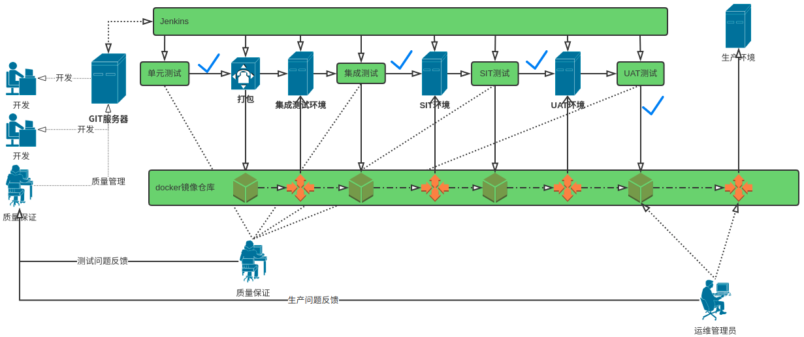
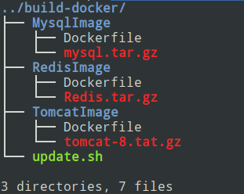
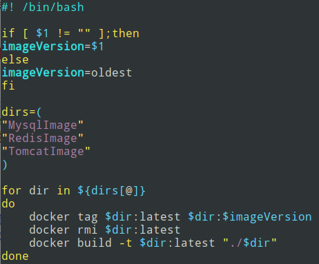
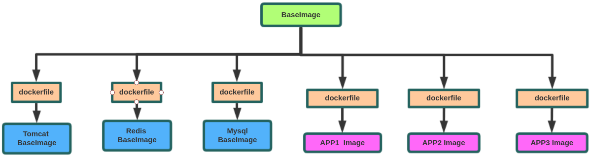

# CPAAS容器镜像生命周期管理

## 1.什么是容器镜像生命周期管理
大规模使用容器作为服务运行载体的情况下，如果容器镜像升级更新了，如果没有有效的容器镜像生命周期管理，那么种类繁多的容器镜像升级更新对于运维人员来说简直是灾难。
<div align="center">

<div>图1-1 企业级——开发、持续集成、持续部署流程</div>
</div>

容器镜像仓库中。应用开发人员从镜像仓库直接拉取最新的版本放到本地仓库进行开发，形成代码做成dockerfile


## 2.如何进行容器镜像生命周期管理

### 2.1 方案一
<div align="center">

<div>图2.1-1 方案一</div>
</div>

该方案如上图所示：

1. 每一层级的容器镜像通过Dockerfile相关联。
2. Dockerfile在每一次BaseImage升级更新中，不用做任何更改。
3. 更新BaseImage之后，执行docker tag 命令，将旧版本的子镜像重命名为其他版本，如v5。
4. 通过docker rmi 命令删除旧版镜像
5. 重新执行 docker build命令，构建latest版本镜像。

在如下图的目录下：
<div align="center">

<div>图2.1-2 镜像仓库服务器目录</div>
</div>

可执行自动化脚本：
<div align="center">

<div>图2.1-3 基础镜像升级脚本</div>
</div>

---

#### 场景一：BaseImage进行了更新
``` shell
docker tag rhel7.5:latest rhel7.5:oldest
docker rmi rhel7.5:latest 
docker load -i new-rhel.tar
./update.sh
```
> 直接执行上述命令即可，也可以将上述命令放入脚本中，在更新基础镜像的时候执行脚本。

#### 场景二：tomcat进行了更新
> 如果是tomcat中间件进行了更新，那只要将<图2.1-2> 中的tomcat-8.tar.gz 进行更新即可。然后通过执行docker build即可。可脚本自动化。

#### 场景三：APP1 进行了更新
> 同上

#### 场景四：如果在基础镜像更新之后，未来得及更新tomcat镜像，而APP使用了旧版的tomcat镜像
> 无需担心，APP中的Dockerfile 写的是 FROM  tomcat：latest，发现tomcat基础镜像更新之后，重新拉取启动容器，然后销毁旧版容器即可。


### 2.2 方案二
<div align="center">

<div>图2.2-1 方案二</div>
</div>

该方案如上图所示：

1. 所有镜像都FROM 基础镜像，都通过dockerfile与基础镜像相关联。
2. 当基础镜像更新之后，所有的APP的镜像拉取最新的基础镜像构建应用镜像。