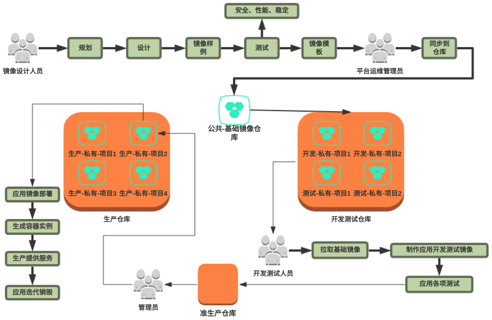
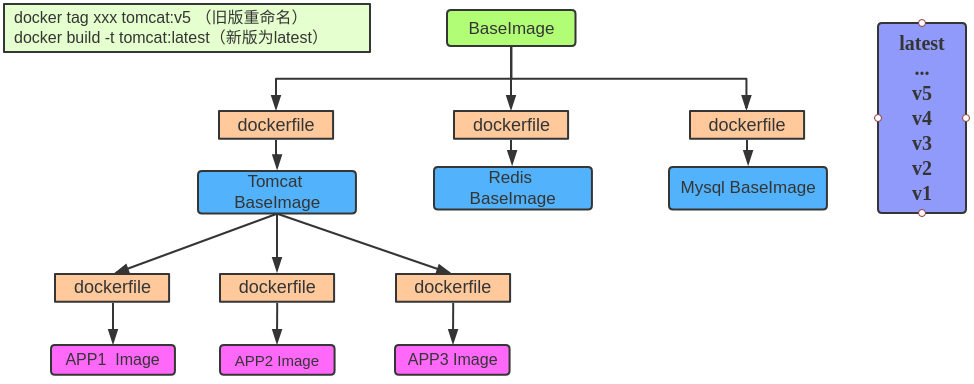

# CPAAS容器镜像生命周期管理

## 1.什么是容器镜像生命周期管理
容器的使用离不开镜像。以Docker为代表的容器技术，可以将应用打包成标准格式的镜像，并且应用会以容器的方式再度启用运行。在真正的生产环境中，我们会需要大量的镜像，第三方或者是自建的；大量镜像伴随而来的是需要保存、分发、使用、升级更新等管控工作。

如果没有有效的容器镜像生命周期管理，那么种类繁多的容器镜像升级更新对于运维人员来说简直是灾难。

为了使大家在CICD场景中，对容器镜像生命周期管理有一个更加直观的观察。请看下图：
<div align="center">

<div>图1-1 企业级——开发、持续集成、持续部署流程</div>
</div>

1. 经过单元测试之后，代码打包形成第一个“APP镜像”。
2. “APP镜像”进行集成测试
3. “APP镜像”进行SIT测试
4. “APP镜像”进行UAT测试
5. “APP镜像”经过上述四轮测试成功之后，运维管理员将“APP镜像”从开发测试仓库PUSH到生产仓库，最后通过生产CPAAS平台拉取启动容器，提供服务。
6. 最后，APP进行版本迭代更新之后，将旧版本镜像打上版本标签、一段时间过后删除销毁。
7. 完成镜像的整个生命流程。


## 2.如何进行容器镜像生命周期管理

<div align="center">

<div>图2-1 容器镜像生命周期流程图</div>
</div>

## 3.在大规模使用容器作为服务运行载体的情况下，如果基础镜像升级了，如何保证子镜像版本也能够升级。

### 2.1 方案一
<div align="center">

<div>图2.1-1 方案一</div>
</div>

该方案如上图所示：

1. 每一层级的容器镜像通过Dockerfile相关联。
2. Dockerfile在每一次BaseImage升级更新中，不用做任何更改。
3. 更新BaseImage之后，执行docker tag 命令，将旧版本的子镜像重命名为其他版本，如v5。
4. 通过docker rmi 命令删除旧版镜像tag标签。
5. 重新执行 docker build命令，构建latest版本镜像。

构建镜像目录如下图：
```shell
../build-docker
├── MysqlImage
│   ├── Dockerfile
│   └── mysql.tar.gz
├── RedisImage
│   ├── Dockerfile
│   └── Redis.tar.gz
├── TomcatImage
│   ├── Dockerfile
│   └── tomcat-8.tat.gz
└── update.sh

3 directories, 7 files
```

执行自动化脚本，更新“基础镜像”：
```shell
#!/bin/bash

if [ -n "$1" ];then
imageVersion=$1
else
imageVersion=oldest
fi

docker tag rhel7.5:latest  rhel7.5:$imageVersion
docker rmi rhel7.5:latest
```

可执行自动化脚本，构建“基础平台镜像”：

```shell
#!/bin/bash

if [ -n "$1" ];then
imageVersion=$1
else
imageVersion=oldest
fi

dirs=(
"MysqlImage"
"RedisImage"
"TomcatImage"
)

for dir in ${dirs[@]}
do
    docker tag $dir:latest $dir:$imageVersion
    docker rmi $dir:latest
    docker build -t $dir:latest "./$dir"
done
```

---

#### 场景一：BaseImage进行了更新
``` shell
docker tag rhel7.5:latest rhel7.5:oldest
docker rmi rhel7.5:latest 
docker load -i new-rhel.tar
./update.sh
```
> 直接执行上述命令即可，也可以将上述命令放入脚本中，在更新基础镜像的时候执行脚本。

#### 场景二：tomcat进行了更新
> 如果是tomcat中间件进行了更新，那只要将<图2.1-2> 中的tomcat-8.tar.gz 进行更新即可。然后通过执行docker build即可。可脚本自动化。

#### 场景三：APP1 进行了更新
> 同上

#### 场景四：如果在基础镜像更新之后，未来得及更新tomcat镜像，而APP使用了旧版的tomcat镜像
> 无需担心，APP中的Dockerfile 写的是 FROM  tomcat：latest，发现tomcat基础镜像更新之后，执行一次容器构建，然后拉取启动新的镜像，然后销毁旧版容器即可。


### 2.2 方案二
<div align="center">

<div>图2.2-1 方案二</div>
</div>

该方案如上图所示：

1. 所有镜像都FROM 基础镜像，都通过dockerfile与基础镜像相关联。
2. 当基础镜像更新之后，所有的APP的镜像拉取最新的基础镜像构建应用镜像。